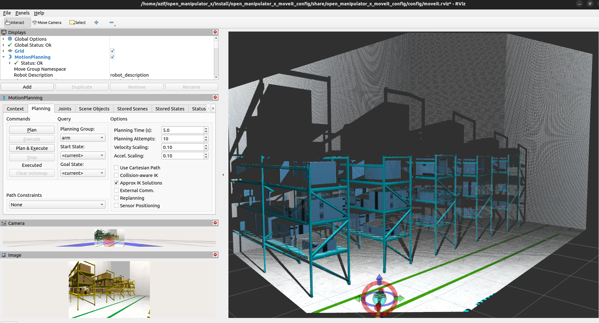
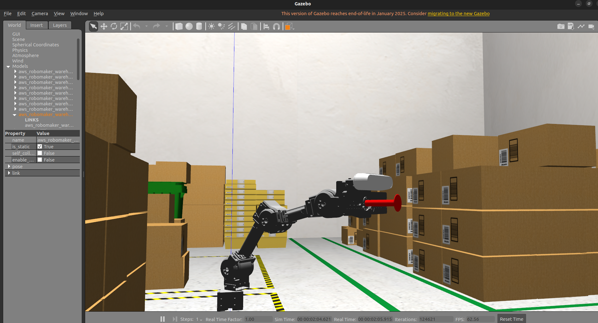
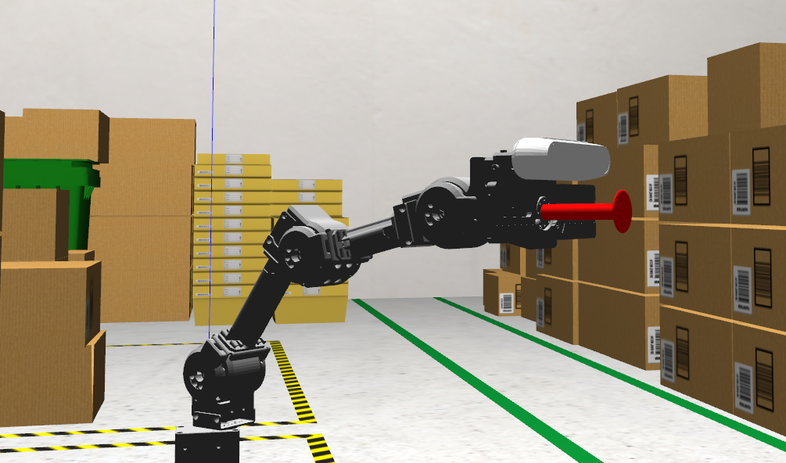

# Open Manipulator X – Enhanced Pick & Place System

**Custom ROS 2 setup with Camera Perception & Vacuum Suction Gripper**





## 🔧 Overview

This project extends the **ROBOTIS OpenMANIPULATOR-X** with:

* **Custom 3D Camera Integration** for point cloud perception
* **Vacuum Suction Gripper** for versatile pick-and-place
* **MoveIt 2 Motion Planning**
* **Interactive GUI for Control & Suction**

---

## 🔬 Key Features

* 📸 **Camera Perception**
  Publishes **point cloud data** for object detection and scene awareness.

* �� **Vacuum Gripper**
  Custom-designed suction-based end effector for precise gripping.

* 🏋️ **Motion Planning with MoveIt 2**
  Plan and execute trajectories with collision awareness.

* 🔹 **Custom GUI Control**

  * Save & Load Poses
  * Move to Target Pose
  * Program Sequences
  * Operate Suction

* ⌨️ **Teleoperation**
  Keyboard control for joints and gripper.

---

## 🗂️ Project Structure

```
open_manipulator_x/
├── open_manipulator_x_bringup/       # Launch files (camera, suction, controller)
├── open_manipulator_x_description/   # URDF with camera & vacuum gripper
├── open_manipulator_x_moveit_config/ # MoveIt 2 configurations
├── open_manipulator_x_gui/           # Custom GUI code
├── open_manipulator_x_teleop/        # Teleoperation nodes
└── media/                            # Images & GIFs
```

---

## 🚀 Installation

### 1️⃣ Prerequisites

* ROS 2 Humble
* Gazebo 11
* OpenMANIPULATOR-X hardware or simulation
* Fast DDS setup for ROS 2

### 2️⃣ Clone and build

```bash
git clone https://github.com/syedazif321/open_manipulator_x.git
cd open_manipulator_x
rosdep install --from-paths src --ignore-src -r -y
colcon build --symlink-install
source install/setup.bash
```

---

## 🔄 Running the System

### Simulation Launch

```bash
ros2 launch open_manipulator_x_bringup bringup_sim.launch.py
```

* Starts Gazebo simulation with camera and vacuum gripper
* Launches MoveIt 2 for motion planning
* Opens the custom GUI

### Hardware Launch

```bash
ros2 launch open_manipulator_x_bringup bringup_hw_camera.launch.py
```

* Runs on real OpenMANIPULATOR-X hardware with camera and suction

### Teleoperation

```bash
ros2 run open_manipulator_x_teleop open_manipulator_x_teleop
```

---

## 🔬 Functional Overview

| Feature             | Description                               |
| ------------------- | ----------------------------------------- |
| **Point Cloud**     | Publishes `/camera/depth/points`          |
| **Suction Control** | Toggle suction from GUI                   |
| **Pose Saving**     | Save current joint poses                  |
| **Program Mode**    | Create & execute movement sequences       |
| **MoveIt Planning** | Plan in 3D space using GUI or MoveIt RViz |

---

## 📸 Media Example

|      GUI & Simulation      |
| :------------------------: |
|  |

---

## 💡 Future Work

* Autonomous pick & place using camera perception
* Add object segmentation for better manipulation
* Real robot deployment with ROS 2 pipelines

---

## 🔖 License

This project is licensed under the **MIT License**.

---

## 🙏 Acknowledgments

Based on the **ROBOTIS OpenMANIPULATOR-X platform**, enhanced with custom hardware and perception integration.
